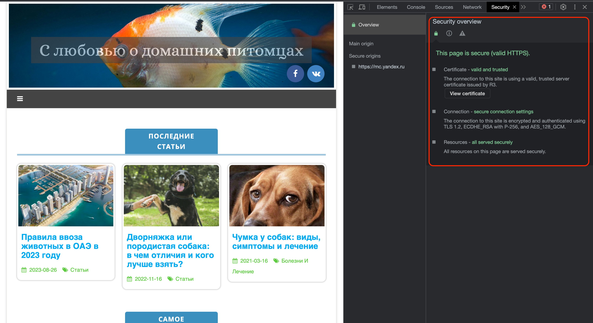

# Д/З по семинару. #
# Урок 1. Веб-технологии: вчера, сегодня, завтра.

## Задача: на основе сайта https://pet7.ru/
- Определите, на каком протоколе работает сайт.
- Проанализируйте структуру страницы сайта. Покажите в коде где хедер, футер и контент.
- Внесите не менее 3 изменений на страницу с помощью инструмента разработчика и представьте скриншоты было/стало.
- Создайте прототип низкой детализации.

## Сайт https://pet7.ru/ работает по протоколу:
**https://**, что видно из самой ссылки по, имеющемуся _URL_.

Но в окне браузера это не сразу видно, узнать по какому протоколу работает сайт можно при помощи инструментов разработчика. Для этого в браузере _Chrome_ нажимаем правую кнопку мыши, в появившемся меню выбираем пункт **Просмотреть код**. Нам открылась панель разработчика, в ней необходимо выбрать вкладу _Security_. В ней будет информация о протоколе, если это **https://**, то мы увидим надпись зеленого цвета _This page is secure (valid HTTPS)._
Выглядит это вот так: 

## Cтруктура страницы сайта

